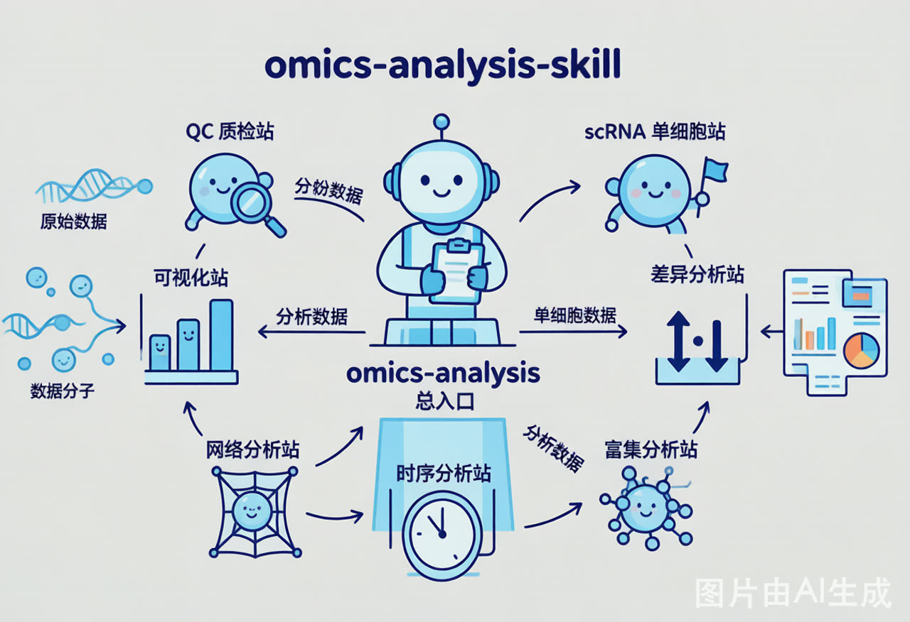

# omics-analysis-skill

Cross-omics Codex skill set for QC, downstream analysis, single-cell workflows, and HXF-style scientific visualization.



## What This Skill Set Does

`omics-analysis-skill` is organized as a router plus focused modules. The main entry skill keeps the analysis from guessing assay type, matrix state, contrast, batch design, thresholds, or output requirements too early. The module skills then handle the specific task.

Use `omics-analysis` when the task is broad or under-specified. Use a module directly only when the assay, input object, contrast or trait, matrix state, and expected output are already clear.

## Included Skills

- `omics-analysis`
  Main entry skill for task intake, mandatory questioning, module dispatch, and audit-aware routing.
- `omics-qc-process`
  QC module with workflow rules for proteomics, bulk RNA-seq, metabolomics, and single-cell RNA-seq, including risk-sample reporting and special-condition branching.
- `omics-scrna-process`
  Single-cell RNA-seq downstream module for multi-sample integration, clustering, cell-type annotation, DEG analysis, trajectory analysis, cell-cell communication, and stemness prediction.
- `omics-differential-analysis`
  Differential analysis module for DEG, DEP, and DEM-style tasks.
- `omics-enrichment-analysis`
  Enrichment analysis module for GO, KEGG, ORA, and GSEA.
- `omics-time-series-analysis`
  Time-series module for ordered time-point and Mfuzz-style workflows.
- `omics-network-analysis`
  Network module for WGCNA-style co-expression or co-abundance workflows.
- `omics-visualization`
  HXF-style visualization module for omics results, clinical phenotype associations, model results, figure revision, and reproducible R plotting.

## Install

Install all skills from this repository with:

```bash
python <CODEX_HOME>/skills/.system/skill-installer/scripts/install-skill-from-github.py --repo azzned9-crypto/omics-analysis-skill --path omics-analysis omics-qc-process omics-scrna-process omics-differential-analysis omics-enrichment-analysis omics-time-series-analysis omics-network-analysis omics-visualization
```

Restart Codex after installation so the new or updated skills are indexed.

## Current Update

This release keeps the existing scRNA/QC-capable `omics-analysis` router intact and expands `omics-visualization` into a full HXF-style plotting module.

Compared with the previous GitHub version:

- `omics-visualization/SKILL.md` was expanded from a compact visualization checklist into a full plotting workflow.
- `omics-visualization/agents/openai.yaml` now explicitly routes `$omics-visualization` toward HXF-style R visualization with PDF and PNG export.
- HXF-vis reference resources were copied into `omics-visualization/references/`.
- Legacy plotting templates were added under `omics-visualization/references/legacy-code/`.
- Clinical mock data and data dictionary were added as optional testing resources, not as default omics inputs.
- A lightweight `omics-analysis/references/omics-visualization.md` reference was added for the main router's visualization handoff.

## HXF Visualization Sync

The visualization module now includes rules and resources that previously lived only in HXF-vis:

- unified `theme_bw()` / `x_theme()` plotting style
- low-saturation palettes for two-group, three-group, multi-class, and differential-direction plots
- default `viridis` handling for continuous variables
- centered diverging scales for z-score, correlation, and log2FC-like values
- volcano, heatmap, enrichment, correlation, PCA/UMAP/tSNE, UpSet, Venn, Sankey, forest, KM, ROC, calibration, and DCA guidance
- minimum pre-plot questions
- output requirements for PDF vector files plus PNG previews
- rules for refactoring legacy R plotting code without inheriting hard-coded paths or unverified statistics

The synced resources are:

```text
omics-visualization/
├── assets/
│   └── mock-clinical-data.csv
├── references/
│   ├── visualization-style-guide.md
│   ├── legacy-code-index.md
│   ├── mock-data-dictionary.md
│   └── legacy-code/
└── scripts/
    ├── generate_mock_clinical_data.R
    └── generate_mock_clinical_data.ps1
```

## Routing Examples

Proteomics differential analysis:

```text
omics-analysis
-> omics-qc-process
-> omics-differential-analysis
-> omics-visualization
```

Single-cell RNA-seq:

```text
omics-analysis
-> omics-qc-process
-> omics-scrna-process
-> omics-visualization
```

Figure-only revision:

```text
omics-visualization
```

## Design Principles

- Confirm assay type, sample type, platform or library strategy before analysis.
- Record matrix state, contrast, batch handling, thresholds, and module choice.
- Report risk samples rather than silently removing them.
- Keep statistical analysis and visualization responsibilities separate.
- Preserve scientific meaning before changing aesthetics.
- Use R and reproducible plotting code by default.

## Notes

- Skill folder names remain in English for portability.
- Skill bodies and configuration content are written mainly in Chinese.
- HXF-vis resources are included to support consistent plotting style, but `omics-visualization` remains an omics-first visualization module.
